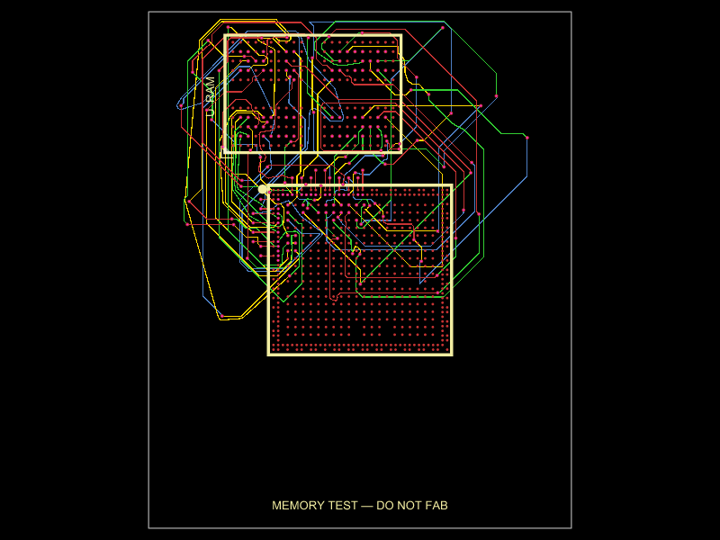

# G350-style integrated Linux handheld — in progress

The Linux/GPU processor, RAM and power management must be directly on the handheld PCB. **The integrated design is not ready to fabricate or order.** The default entry displays a memory-routing experiment. Existing Revision B Gerbers and `rev-b.circuit.tsx` describe an external Raspberry Pi carrier and do not satisfy this requirement. The fabrication exporter blocks release while integration is incomplete.

The architecture under investigation is a bare **Rockchip RK3566**, **1 GB Hynix LPDDR4**, **RK817-5 PMIC** and **RK860-0 CPU regulator**, authored in tscircuit. Individual components were imported with `tsci import --jlcpcb --use-exact-footprint`. No complete computer board or processor module is imported. See [the integrated-host design record](docs/INTEGRATED_HOST.md).

The completed handheld must have all components on top, eleven front buttons, an FPC display, an onboard microSD holder and one USB-C connector for charging and data/provisioning. It has no analog sticks or rear buttons. Imported power ICs and the microSD socket are candidates for integration; the memory fixture does not yet contain those circuits.

## Current routing work

`experiments/rk3566-memory.circuit.tsx` tests direct autorouting with the actual 565-ball SoC and 200-ball RAM footprints. Its first clock/strobe phase timed out at 120 seconds. `experiments/rk3566-memory-vip.circuit.tsx` adds 134 explicit full-depth escapes and moves RAM closer to the processor. Some outer-row vias are staggered outside the processor; 25 fine-pitch escapes use 0.25mm lands, and the other escapes use 0.30mm lands. All drills are 0.15mm. The latest manual geometry passes its drill-to-copper/drill-to-drill precheck.

An earlier eight-phase trial routed 39/67 signals before timing out, using escape lands that subsequently failed the drill-clearance review. Three-signal retries reached the planner's iteration limit. The current retry routes the 24 inner-array signals before clocks/strobes and the outer data/control signals. The byte-group trial hit the planner limit; the current experiment uses 31 individual outer-signal phases after six earlier phases, plus two manual fanout stages. Each phase uses the installed local Pipeline 9 autorouter with earlier copper frozen as obstacles. A four-layer routing model maps onto the four signal layers of the physical six-layer board because the current router ignored the bus layer restriction. Physical through-vias remain obstacles on every signal layer; Inner1/Inner4 are reserved for future reference planes.

The earlier 24-signal diagnostic failed Gerber shorts and independent KiCad DRC. Eight local via movements and one wire dogleg repair those routes: the repaired diagnostic passes Gerber shorts and KiCad copper/drill clearances, while retaining 43 unrouted signals and incomplete-fixture warnings. At that stage, only those checked routes were retained under a full input fingerprint. Later routing progress is described below. New vias and wires are checked against actual physical copper/drills. See `checks/integrated/repaired-check-summary.json` and `checks/integrated/phase-via-validation.json`.

The through-via terminal-access retry completed clocks/strobes, reaching 36/67 signals. Seven explicit outer traces now extend the fixture to **43/67**: DQ0_A uses a reviewed path with six points, five further traces use a supplementary constant-layer grid search, and DQ4_A uses a grid-planned detour with one full-depth layer-change via. The six initial phases retain actual Pipeline 9 routing; remaining unmatched phases still use the live Pipeline 9 autorouter. Explicit coordinates are reused only under the complete input fingerprint and fresh wire/via checks.

The actual **43-signal** diagnostic passes Gerber shorts and independent KiCad copper/drill checks. Its connectivity graph confirms 43 signals, with **24 opens and 61 dangling-via warnings** remaining. DQ8_A timed out at 134.4 seconds; bounded one- and two-via grid searches have not found an accepted continuation. See `checks/integrated/memory-43-check-summary.json`, `memory-43-connectivity.json` and `memory-43-phase-validation.json`. This is routing progress, not a manufacturing release.



These are **memory-routing feasibility fixtures**, containing 67 datasheet-checked signal connections. They omit host power, decoupling, clock, boot, storage, USB, display, controls and audio circuits. They cannot run Linux. DDR timing, coupled-pair geometry, reference planes, impedance, package flight times and electrical via lengths require qualification on the complete host.

Eighteen imported RAM pads were off the manufacturer's nominal grid and have been corrected. The SoC and RAM grids and all 67 signal functions pass the import checker. All 69 PMIC pin aliases were checked; internal 1.8 V filter rails must be decoupled rather than driven by another regulator. The microSD shell/contact aliases were corrected against its manufacturer drawing; full geometry comparison remains pending. Attempt sources, logs and verification evidence are in `checks/integrated/`.

## Build the memory fixture

Versions verified and pinned on 2026-10-02: **tscircuit 0.0.2727**, **tsci CLI 0.1.2227**, **capacity-autorouter 0.0.951**. The npm lock uses legacy peer resolution because the current upstream CLI and tscircuit packages request different circuit-json peer versions.

```sh
npm ci --legacy-peer-deps
npm run typecheck
npm run check:integrated-imports
npm run build:memory > checks/integrated/memory-vip-build.log 2>&1
npm run check:memory-escapes
npm run check:memory-connectivity
```

`npm run check:shorts` first requires complete memory connectivity, then runs the Gerber shorts checker on that same fixture output. Run independent DRC on the actual exported copper too. Shorts checks on an aborted render with no traces or vias do not prove routed connectivity. None of the fixture's checks qualifies the completed handheld.

The six-layer trial targets ENIG with **filled and copper-capped** 0.15mm drilled vias, no blind or buried vias, and top-only assembly. This is a proposed fabrication process. Final stackup, impedance, drill clearances and manufacturer assembly review remain required. [JLCPCB's capabilities](https://jlcpcb.com/capabilities/pcb-capabilities/) provide the fabrication limits used in this investigation.

## Repositories and earlier revision

- [GitHub](https://github.com/Abse2001/g350-linux-handheld)
- [tscircuit registry](https://tscircuit.com/abse/g350-linux-handheld)
- [Historical Revision B carrier documentation](docs/REV_B_CARRIER.md)
- [Historical fabrication status](fabrication/STATUS.md)

Registry v1.1.0 still describes Revision B. **1.2.1-integrated-experimental** contains the checked 36-signal integrated source; all 105 stored files were verified by SHA-256 after recovering an archive-response timeout. The current 43-signal source uses **1.2.2-integrated-experimental**. Experimental versions remain explicitly incomplete; the old carrier's successful checks cannot be reused for Revision C.

`tsci push` currently ignores `.gitignore`. Use `node scripts/stage-registry-source.mjs tmp/registry-source-VERSION` to prepare the reviewed tracked source allowlist, then push from that directory. It excludes local reference PDFs, temporary work and historical fabrication archives. An aborted native render with no copper is never accepted as a shorts/connectivity pass.
