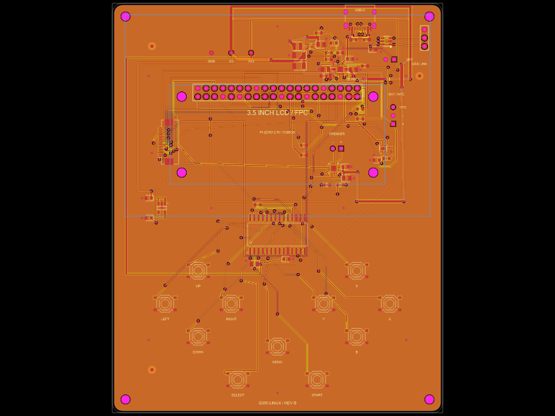

# G350-style Linux handheld

**Revision B PCB fabrication files are ready for a first prototype order. All carrier components are fitted on top, and one USB-C port provides charging and data. See `fabrication/STATUS.md` for order settings and checks. The assembled handheld has not been tested on hardware.**

Custom tscircuit handheld PCB, revision B. A complete Raspberry Pi Zero 2 W is the Linux/GPU host, connected through a **hand-drawn J8 interface and mechanical layout** in `lib/PiZero2W.tsx`. The Pi's proprietary computer circuitry is not recreated here. No complete SBC PCB design is imported.

The four-layer, 100 × 124 mm carrier includes eleven front switches, an MCP23017, a MAX98357A speaker amplifier, a BQ24074 battery charger with load sharing, a TPS61023 5 V boost supply, a MAX17048 fuel gauge and an AP2112 3.3 V display regulator. It has no analog sticks or rear buttons. J_LCD is assembled on top and faces the display interior for ribbon insertion. Individual active devices, switches, the USB-C and FPC connectors, the display regulator and the inductor were imported using `tsci import --use-exact-footprint` from JLCPCB.

This is a G350-inspired custom handheld, **not a replacement PCB that fits the stock G350 shell**. The selected SPI display is 480 × 320 in landscape, rather than the stock G350's 640 × 480 display. The Raspberry Pi provides its CPU, GPU, RAM, Wi-Fi and microSD boot storage.



[Download the Revision B Gerbers](fabrication/g350-rev-b-gerbers.zip), [order status](fabrication/STATUS.md) and [schematic preview](images/schematic-rev-b.png).

## Build and checks

The project pins the latest tscircuit version found on 2026-10-02: **0.0.2715**. Always use the local CLI:

```sh
npm ci
npm run typecheck
npx --no-install tsci check source index.circuit.tsx
npx --no-install tsci check pin_specification index.circuit.tsx
npx --no-install tsci check netlist index.circuit.tsx
npx --no-install tsci check schematic-placement index.circuit.tsx
npx --no-install tsci check placement index.circuit.tsx
npx --no-install tsci check routing-difficulty index.circuit.tsx
npx --no-install tsci build index.circuit.tsx --autorouter-debug --autorouter-dump-srj all --pcb-png --schematic-png --kicad-project > checks/build.log 2>&1
npm run compact:circuit
npx --no-install tsci check shorts dist/index/circuit.json --mode gerber --layer all > checks/shorts.log
npm run check:kicad
npm run fabrication
```

The wide manual power feeds use the outer layers; the autorouter can use all four copper layers. Manual SPI/display-control and selected button tracks use inner1, with MISO, I2C clock and charging-status branches on inner2; ground pours surround them on all four layers. Routing uses the local tscircuit autorouter with explicit CONTROLS, POWER and DISPLAY_AUDIO phases, reserving I2C/control escapes before broad supplies and then display/audio signals. The switching-node route, charger exposed-pad ground connection, charger setting/status escapes, USB and battery feeds, battery thermistor connection, boost feedback/enable connections, amplifier/button-controller/fuel-gauge bypass connections, Pi and button-controller supply branches, wide amplifier/boost input feeds, button-controller reset, amplifier mode/enable connections, LCD supply/select/reset/backlight/touch-IRQ and inner-layer SPI/control connections, I2C clock, UP/SELECT/MENU paths and LEFT input escape, charging indication, status pull-up feeds, gauge I2C branches and I2S clock/data connections are drawn manually. Check results and release limitations are recorded in `checks/` and `fabrication/STATUS.md`.

`lib/PhasedAutorouter.ts` uses the installed tscircuit package's latest local solver in each phase, treats completed earlier phases as fixed copper obstacles and makes through-hole terminals accessible from all four layers. Inner signal paths retain their actual layers in the routing obstacles, with blind/buried vias disabled and full-depth via spans checked before release. `ConservativeTraceObstacles.ts` compacts overlapping trace samples into conservative envelopes; pads, holes, vias and fine-pitch escapes stay unchanged, and the original obstacle coverage is verified in `checks/router-obstacles.log`. `ThroughSignalVia.ts` adds the inner access ports omitted when core 0.0.2043 constructs a via before its board parent; the physical vias remain full-depth and their spans are checked in the exported board. Ground returns use filled zones and stitching vias. Short copper contacts inside GND pads explicitly identify the plane net to tscircuit's trace connectivity check; independent KiCad connectivity verifies the physical ground return. Width transitions are explicitly encoded so the native clearance checker and KiCad export evaluate the same segment widths. The helper rejects failed routes; final connectivity and shorts checks qualify the resulting copper. The top assembly side has three fiducials with copper keepouts around their mask openings. All carrier components, including every harness header and the USB-C/FPC connectors, are fitted on top. Bottom copper remains available for routing; it has no component placements. Component reference text is retained in the assembly data; the PCB silk uses clear connector and control labels. The USB connector silk outline is inset from the routed board edge; its imported copper footprint is unchanged.

The release exporter requires a successful three-phase build, a fresh all-layer shorts result and an independent KiCad report with zero violations, zero warnings and zero unconnected items. `prepare-kicad-library.py` exports the exact project footprints through KiCad’s native serializer into a local `tscircuit.pretty` library and writes `fp-lib-table`. It checks that all physical board records are unchanged while assigning distinct library identities. The final DRC validates those local footprints. The checks use KiCad 10 and its `pcbnew` Python module; the installed macOS runtime is detected automatically. Set `G350_KICAD_PYTHON` for a different interpreter with that module. `prepare-kicad.mjs` restores the fiducial keepouts' declared placement allowance, which the current converter drops. The keepouts still exclude tracks, vias and copper pours. It restores the full through-via span declared in Circuit JSON when the converter duplicates inner-layer transitions, removes the resulting identical duplicate vias and assigns distinct priorities to touching ground-zone outlines and asks KiCad to discard disconnected copper islands when refilling zones. The switching-node pour keeps priority over the surrounding ground.

Production Gerbers are plotted from the independently checked and refilled KiCad conversion of the tscircuit board. Gerbers, separate plated/non-plated drills and supplier-verified CPL placements all use the lower-left bounding corner as their origin. The release verifier compares actual Gerber pad flashes, plated/non-plated drills and every exported KiCad track with the tscircuit model. `fabrication/SHA256SUMS` identifies the released files. See `fabrication/STATUS.md` before ordering.

The tscircuit registry limits individual uploads, so large STEP models are distributed there as lossless `.step.gz` files. Run `npm run restore:models` after downloading that repository to restore the local KiCad and imported component models; the command verifies the original release checksums. GitHub also includes the uncompressed models. Circuit JSON is compacted before final checks without changing any parsed values. The Gerbers and assembly files are identical in both repositories.

Manufacturing targets green solder mask, 1 oz outer copper and standard 0.5 oz inner copper. Pad-sized mask openings follow JLCPCB's current 1:1 mask capability; fiducials retain their larger explicit openings. Visible labels are at least 1 mm high. Through-hole spacing is checked against a conservative 0.45 mm minimum. These limits follow the [JLCPCB rigid-board capabilities](https://jlcpcb.com/capabilities/pcb-capabilities/).

`SavedRouting.ts` retains the actual three-phase Pipeline 9 routes after manual clearance corrections to the DOWN fanout, A-button bridge and CC1 path. It reuses a phase only when the SHA256 of its complete routing input and both pinned tool versions match; changed designs run the live autorouter. Earlier-phase routes and ground contacts remain preserved. `routing/initial-autorouter-run.log` records the original solver run and its subsequently corrected geometry errors; `checks/build.log` and the final independent checks qualify the release. The manual reset and I2S frame-clock paths also include clearance corrections. No draft route-cache bypass remains.

## Assembly

The qualified release includes `bom-jlcpcb.csv` and `pnp-jlcpcb.csv` for SMD assembly, plus `bom-manual.csv` for the through-hole headers, external modules, cables and mounting hardware. Fit all unshrouded harness headers on the top side.

- Raspberry Pi Zero 2 W with its microSD holder and a populated GPIO header; mount the module on top-side insulating standoffs, keeping access to the microSD slot. Use a microSD card sized for the selected Linux image; use a numbered, straight-through 40-wire GPIO ribbon. Do not use a cable that swaps pin rows. J_PI numbering is interleaved exactly like J8.
- Waveshare **3.5inch Capacitive Touch LCD**, ST7796S + FT6336U, with its **18-pin, 0.5 mm FPC host port**. This is a different product from RPi LCD (G). J_LCD is an imported XUNPU FPC-05F-18PH20 bottom-contact connector (C2856802). Use an 18-conductor, 0.5 mm, 0.3 mm-thick FFC; verify continuity pin 1 to pin 1 before applying power. Cable contact-side selection depends on the module connector orientation; do not infer it from the ribbon color.
- Protected 1S 4.2 V Li-ion/LiPo battery with a **10 kΩ 103AT-2-compatible NTC attached to the cell**. J_BAT pin 1 is battery positive, pin 2 is negative and pin 3 is NTC. NTC returns to battery negative. Unprotected cells and 4.35 V charge-voltage cells are unsuitable.
- 8 Ω speaker rated at least 2 W between J_SPEAKER pins 1 and 2. Both pins are driven; neither is ground.
- External slide switch across J_OFF: closing it disables the boost output. Shut Linux down before moving this switch to OFF.
- J_USB_LINK is a top-side, data-only connection to the Pi's **USB** micro-B port. Pin 1 is D− (micro-B pin 2), pin 2 is D+ (micro-B pin 3), and pin 3 is ground/shield (micro-B pin 5). Use a nominal 100 mm shielded pigtail with a twisted D+/D− pair, allowing plug and bend clearance. The straight-line gap from the module's USB port to this header is about 57 mm in the drawn orientation, so a 50 mm lead is too short. Leave micro-B pin 4 ID open. **Disconnect and insulate micro-B pin 1 VBUS**; a normal four-wire power/data cable would join the charger input to the Pi's boost output. Verify this isolation before connecting a computer. Do not connect to the Pi's PWR IN port.
- Hand-fit the through-hole harness headers. Imported SMD components may be assembled by JLCPCB subject to availability. Verify the supplier's placement viewer, rotations and polarity before submitting an assembly order.

The LCD and Pi share the top assembly side. Select insulating standoff heights from the actual Pi, carrier components, GPIO headers and display stack; leave microSD insertion/removal and USB pigtail access. The Pi mounting pattern is 58 × 23 mm, with four 2.75 mm holes. Use insulating M2.5 nylon hardware and a numbered GPIO ribbon. The custom enclosure, stacked-part clearances and antenna performance require a physical fit check. Keep battery wiring short and use wire rated for at least 3 A. Power the Pi through the carrier GPIO header. The carrier's back has no component bodies; through-hole solder joints and copper remain there.

## Display ribbon

The selected module is 92.44 × 61 mm in landscape, with a 480 × 320 active display. The carrier width is 100 mm to accommodate it. Its host supply is a separate 3.3 V rail from AP2112; this keeps the module's input logic and I2C pull-ups at Pi-compatible levels. Typical manufacturer-stated module current is about 63 mA; the LDO dissipates about 0.11 W at that load. This does not qualify the enclosure's thermal behavior.

| J_LCD FPC pin | Module signal | Pi BCM GPIO / connection |
|---|---|---|
| 1 | VCC | V_LCD3V3, 3.3 V only |
| 2 | LCD_BL | 23 |
| 3 | GND | GND |
| 4 | SCLK | 11 |
| 5 | MOSI | 10 |
| 6 | MISO | 9 |
| 7 | LCD_D/C | 22 |
| 8 | LCD_RST | 27 |
| 9 | LCD_CS | 8 |
| 10 | SD_CS | 3.3 V, unused card deselected |
| 11 | NC | Open |
| 12 | Reserved, marked NC in module schematic | Open |
| 13 | TP_SCL | 3 / shared I2C |
| 14 | TP_SDA | 2 / shared I2C |
| 15 | TP_INT | 25 |
| 16–18 | NC | Open |
| Connector anchors | Mechanical shell | GND |

Do not use a stock display setup that assigns backlight to GPIO18: this design uses GPIO18 for I2S BCLK. Install a display driver supporting ST7796S and the above custom pin assignments. FT6336U touch shares the I2C bus at address 0x38; the button and battery daemon does not implement touch. The manufacturer's schematic marks host FPC pin 12 NC, so it stays open; touch uses the module's power-on reset. Display and touch driver bring-up have not been tested on hardware. The module's microSD slot is not used; boot storage remains on the Pi. Full-frame SPI transfers limit refresh rate: 480 × 320 × 16-bit pixels require 2.46 Mbit per frame, giving a theoretical 13 frames/s at a 32 MHz SPI clock before overhead. Measure the chosen driver and games during bring-up.

## Install Linux using the same USB-C port

Boot storage is the microSD card in the **Pi Zero 2 W's existing holder**. It is part of the external Pi module; the carrier does not duplicate an electrically unavailable SDIO interface on J8. Keep that holder accessible in the enclosure. The display module's separate card holder remains unused.

For the first installation, fit a blank microSD card, a charged protected battery and the verified data-only Pi USB pigtail. With the handheld off, connect the carrier USB-C to a computer using a data-capable cable. Start Raspberry Pi's official `rpiboot` on the computer with its `mass-storage-gadget64` image, then switch the handheld on. The Pi's USB device boot runs a temporary installer in RAM and exposes the card to the computer. Use Raspberry Pi Imager to select **Raspberry Pi Zero 2 W**, the desired compatible Linux image and that exposed card; check the target size before writing. After verification, eject the card/device, power the handheld off and then restart to boot the installed card.

The Pi normally tries the SD card first. A bootable installed card therefore prevents this blank-card USB provisioning path from being selected. For recovery, shut down, remove the card and reimage it in a card reader, or make its boot partition unbootable before a USB reinstallation. There is no dedicated forced-USB-recovery input on this Pi module. Never export the running root filesystem as writable USB mass storage.

After building the official `usbboot` tools on the computer, run this from their source directory before switching the handheld on:

```sh
sudo ./rpiboot -d mass-storage-gadget64
```

On the installed Pi, enable `dtoverlay=dwc2,dr_mode=peripheral` under `[all]` in `/boot/firmware/config.txt`, then reboot. Install `python3-gpiozero`, copy `software/usb-gadget.sh` to `/usr/local/sbin/g350-usb-gadget` with executable permissions and `software/usb_power.py` to `/usr/local/lib/g350/`. Copy the two `g350-usb-*.service` files into `/etc/systemd/system/`, run `systemctl daemon-reload`, and enable both services plus `serial-getty@ttyGS0.service`. The shared connector then provides a USB serial login and controlled USB500 charging. The prototype gadget identifiers and software must be reviewed for a production product. Display, audio and button setup are separate from OS flashing.

These procedures follow [Raspberry Pi USB device boot](https://www.raspberrypi.com/documentation/computers/raspberry-pi.html#usb-device-boot-mode) and the official [USB provisioning tool](https://github.com/raspberrypi/usbboot). They have not been exercised on an assembled G350 prototype.

## Linux interfaces

Enable I2C and I2S on the Pi. MCP23017 uses address `0x20`, MAX17048 uses `0x36`. Pi J8 already provides I2C pull-ups to 3.3 V. The buttons use GPA0–GPA6 and GPB0–GPB3; Y is GPB3. GPA7/GPB7 stay unconnected and are configured as outputs, following the current Microchip datasheet. `software/handheld.py` provides a Linux uinput gamepad from the eleven front controls; it also reads battery voltage and charge state. Run it as a system service only after initial bring-up. Do not enable a competing kernel MCP23017 driver while using this daemon.

I2S: GPIO18 BCLK, GPIO19 LRCLK, GPIO21 data output. GPIO26 enables the amplifier; the amplifier uses its left channel at 6 dB gain. `software/asound.conf` mixes both input channels equally into the left output. Copy it only after identifying the I2S ALSA device on the Pi.

## Power limits and prototype bring-up

One USB-C connector carries both **5 V charging power and USB 2.0 data**. Its two independent 5.1 kΩ CC resistors identify a sink; no USB PD is negotiated. The data lines use the exact JLCPCB USBLC6-2SC6 ESD footprint and connect to the Pi through J_USB_LINK. USB VBUS powers only the charger and the ESD reference, not the Pi USB plug. The carrier's boost supplies the Pi through J8.

BQ24074 EN1 and EN2 have external pull-downs, selecting USB100 (at most 100 mA) at power-on. GPIO24/J8 pin 18 controls EN1; GPIO16/J8 pin 36 controls EN2. The included USB serial gadget advertises 500 mA, and `software/usb_power.py` selects USB500 only after that gadget reaches the configured state. It selects input suspend on a suspended connection. Because the Pi's USB VBUS is isolated, the service uses USB_GOOD_N on GPIO12/J8 pin 32 to bind the gadget only when actual USB input power is present and unbind it when that power disappears. Without these services, including initial `rpiboot` installation or connection to a wall charger with no data enumeration, the input remains limited to 100 mA. Charging is nominally 270 mA when the input/system budget permits; a nominal 9.07-hour timer remains. The battery may discharge while playing or during installation, so begin USB provisioning with a charged, protected battery. USB enumeration, disconnect detection, suspend timing, signal integrity and charging behavior still require hardware validation.

The boost target is 4.992 V (0.6 × (1 + 732k/100k)). Begin with a 1 A total 5 V load ceiling, an 8 Ω speaker and restrained volume. Validate regulator ripple, load transients, temperature, charging behavior and battery protection before increasing loads. The fuel gauge is a monitor; the battery pack must provide hardware over-discharge/over-current protection.

Bring up with a current-limited bench supply and no Pi or LCD connected. Check for resistance between rails, verify 5 V and charge current, then test a dummy load and OFF control. Connect the Pi next, verify 3.3 V and I2C addresses, then add display, buttons and speaker. No assembled prototype has been tested.

## References

- [Raspberry Pi Zero 2 W documents](https://pip.raspberrypi.com/categories/584)
- [Raspberry Pi Zero 2 W mechanical drawing](https://pip-assets.raspberrypi.com/categories/584-raspberry-pi-zero-2-w/documents/RP-008358-DS-1-raspberry-pi-zero-2-w-mechanical-drawing.pdf)
- [Waveshare FPC LCD pinout and specifications](https://www.waveshare.com/wiki/3.5inch_Capacitive_Touch_LCD)
- [Waveshare 18-pin host schematic](https://files.waveshare.com/wiki/3.5inch%20Capacitive%20Touch%20LCD/3.5inch_Capacitive_Touch_LCD_Schematic.pdf)
- [AP2112 regulator datasheet](https://www.diodes.com/datasheet/download/AP2112.pdf)
- [BQ24074 datasheet](https://www.ti.com/lit/ds/symlink/bq24074.pdf)
- [TPS61023 datasheet](https://www.ti.com/lit/ds/symlink/tps61023.pdf)
- [MAX98357A datasheet](https://www.analog.com/media/en/technical-documentation/data-sheets/MAX98357A-MAX98357B.pdf)
- [MAX17048 datasheet](https://www.analog.com/media/en/technical-documentation/data-sheets/MAX17048-MAX17049.pdf)
- [MCP23017 datasheet](https://ww1.microchip.com/downloads/aemDocuments/documents/APID/ProductDocuments/DataSheets/MCP23017-Data-Sheet-DS20001952.pdf)

Original project source is MIT licensed. Vendor component models and drawings retain their respective rights.
