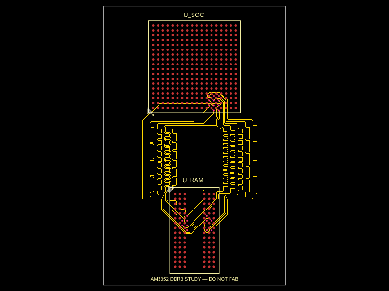

# G350-style AM3352 Linux handheld — in progress

The selected processor is a **bare TI AM3352BZCZ100**, directly on the main PCB, with **512 MB Micron MT41K256M16TW-107:P DDR3L** operated in DDR3-compatible mode. The user chose AM3352 for simple games rendered by the CPU; a 3D GPU is no longer required. The design is authored in **tscircuit**, using individually imported JLCPCB components. No complete SBC or processor module is imported.

**The integrated handheld is not ready to fabricate or order.** The default entry is the new AM3352 DDR signal bootstrap. It has no powered host, storage, USB, display or controls yet. The fabrication exporter remains blocked by `design-status.json`. Previous Raspberry Pi carrier exports and RK3566 routing checks do not apply to AM3352.

The completed handheld must have eleven front buttons, an FPC display, an onboard microSD holder and one USB-C connector for charging and data/provisioning. Components and copper routing are allowed on both sides. There are no analog sticks or rear buttons.

## DDR routing workflow

The [tscircuit DDR routing guide](https://docs.tscircuit.com/guides/routing-ddr) was reviewed on 2026-10-02, including the complete AM3352 example. The native preset is `autorouter="bus_lanes"`. The default circuit uses this preset to generate local dogbones and route the channel. Manual fanouts, placement changes and local trace repairs may supplement it when needed; successful copper still requires independent checks.

The new fixture declares **49 actual shared DDR signals**, two 11-signal byte buses, a 26-signal command/clock timing group, and separate reset. It declares both DQS differential pairs and the CK pair. The 4 Gb x16 memory uses A0–A14; its M7 is NC. CPU DDR_A15 is therefore unused. Numeric port selectors avoid collisions between RAM ball labels such as A3 and address-function aliases with the same name.

All **324 CPU and 96 RAM balls**, functions and nominal 0.8 mm grids have been checked against the manufacturer documents. The supplier import's incomplete CPU aliases and malformed RAM aliases were corrected. CPU pads use TI's 0.4 mm example lands; RAM pads use the Micron TW drawing's 0.42 mm lands. This is a nominal geometry/function check, not complete solder-mask or assembly qualification. See `checks/integrated/am3352-import-validation.json`.

The best checked native result is **11/49 DDR signals**, the complete first byte lane. It has **zero Gerber shorts and zero independent KiCad copper/drill violations**, and passes the byte's 0.635 mm planar skew and DQS pair's 0.127 mm planar skew. **38 signals remain open.** This is an unpowered, partial diagnostic, not a completed DDR channel. [Check summary](checks/integrated/am3352-clearance-11-check-summary.json).

The original 0.30/0.15 mm vias produced 31 drill-clearance errors. Increasing the native dogbone lands to 0.35 mm while retaining 0.15 mm drills removed those errors in the rerouted lane. The second lane still times out. Manual fanouts, permitted data-swapping maps, coordinated dogbones and opposing boundary fanouts are retained as distinct experiments; their failures are recorded instead of being treated as successful copper. See [DDR routing record](docs/AM3352_DDR_ROUTING.md).



The trial uses an eight-layer routing allocation and ordinary full-depth vias. Byte lanes and command/clock are restricted to chosen signal layers, leaving reference-plane resources available. The 0.635 mm bus and 0.127 mm pair skew constraints follow TI's planar limits. The pair gap, actual impedance, via electrical length, power planes, return paths and complete timing budget require qualification on the powered board. A successful solver run alone does not establish those properties.

## Build and verify

Versions verified and pinned on 2026-10-02: **tscircuit 0.0.2727**, **tsci CLI 0.1.2227**, **capacity-autorouter 0.0.951**, with **core 0.0.2048** supporting the native DDR preset.

```sh
npm ci --legacy-peer-deps
npm run typecheck
npm run check:am3352-imports
npm run check:am3352-swizzle
npm run build:memory
npm run check:memory-connectivity
npm run check:shorts
```

The legacy peer option is required by the current upstream packages' circuit-json peer versions. All-layer Gerber shorts, full signal connectivity, end-to-end skew measurements and independent KiCad copper/drill checks must be run on actual exported AM3352 copper. The completed handheld requires fresh checks after power and peripherals are integrated.

## Repositories and records

- [GitHub](https://github.com/Abse2001/g350-linux-handheld)
- [tscircuit: AM3352 experimental source v1.3.0](https://tscircuit.com/abse/g350-linux-handheld?version=1.3.0-integrated-experimental)
- [Current integrated-host record](docs/INTEGRATED_HOST.md)
- [Historical RK3566 host investigation](docs/RK3566_HOST_RECORD.md)
- [Historical RK3566 memory experiments](docs/RK3566_MEMORY_EXPERIMENTS.md)
- [Historical Revision B carrier](docs/REV_B_CARRIER.md)

Registry publication is not fabrication approval. `tsci push` ignores `.gitignore`; use the tracked source allowlist in `scripts/stage-registry-source.mjs` and verify every published file hash. Reference PDFs, temporary files and historical manufacturing archives are excluded.
